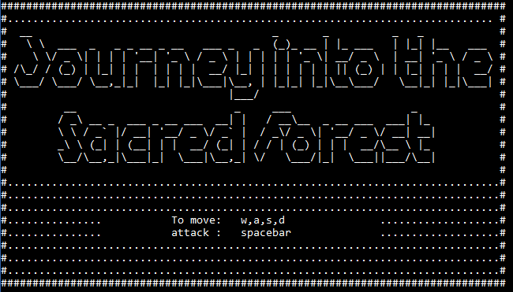
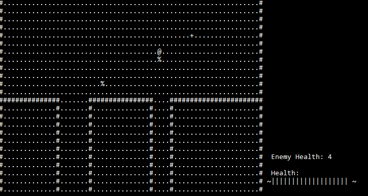
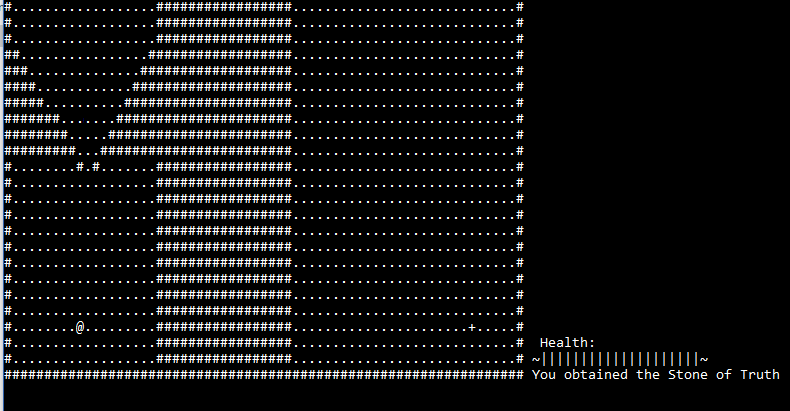
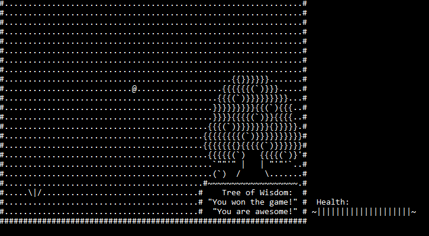

Description:
This is an ascii rogulike RPG I built in my free time.
It could easily be expanded by creating more levels and differnt power ups,
but for now it is a working prototype which has a beginning, middle, and an end!

### Title Screen

### Be careful of enemies

### Spoiler Alert (you need the stone of truth to enter the sacred forest, fetch quest complete!)

### You Won!

Art:
title screen letters are courtesy of:
http://patorjk.com/software/taag/#p=display&f=Graffiti&t=Type%20Something%20
Tree art: unknown artist from asciiart.eu

Check out the Release folder if you want to play the game! (if you are using windows 7 you'll have to run wmic command to resize console window to full screen)

See screen shots if you don't actually want to play the game.
